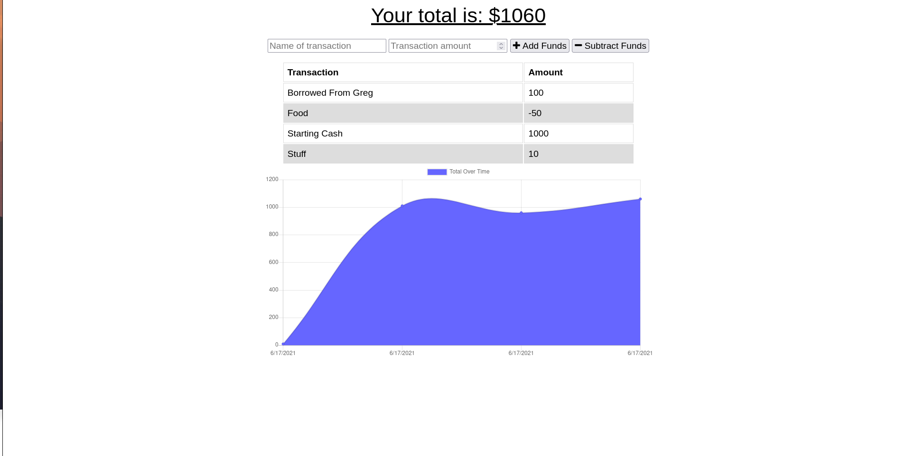

# Budget Tracker App

## Description

This is an app that one can use to keep track of travel expenditures, and will work both off and online.

## Usage

Use the form to add and subtract funds. The database should sync from offline and online.

## Screenshots

## Deployment

[Github Repository](https://github.com/thebadams/budget-tracker.git)

[Deployed URL](https://badams-budget-tracker.herokuapp.com)

## Contact

Please contact me at my email: [bpeteradams@gmail.com](mailto:bpeteradams@gmail.com)

View my github profile [here](https://github.com/thebadams)

## License

MIT License found [here](./LICENSE)